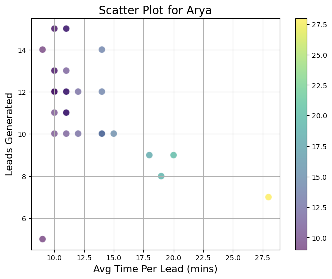
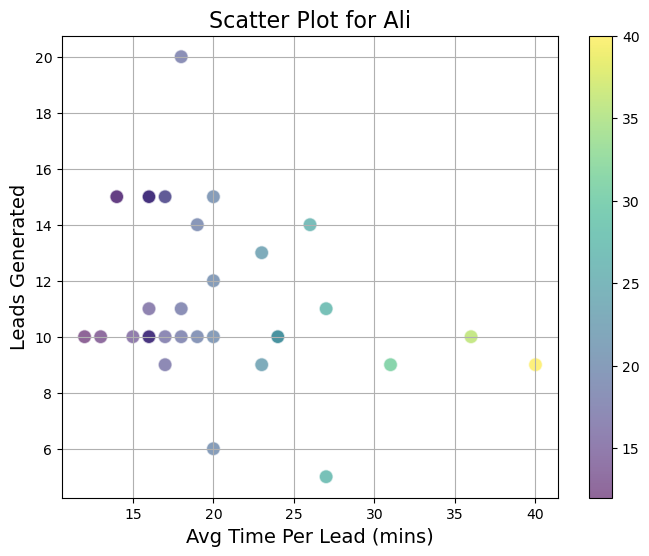
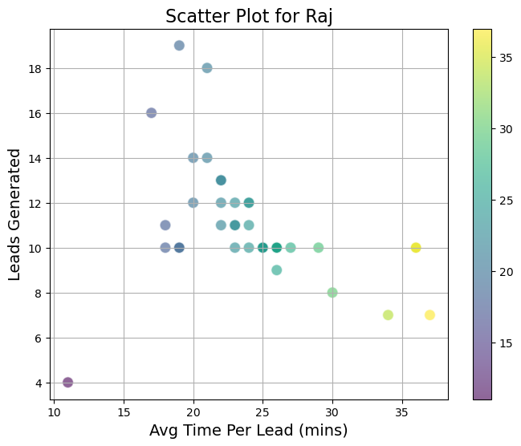
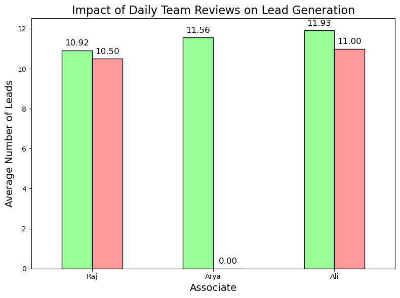
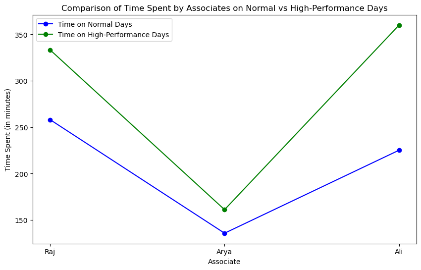
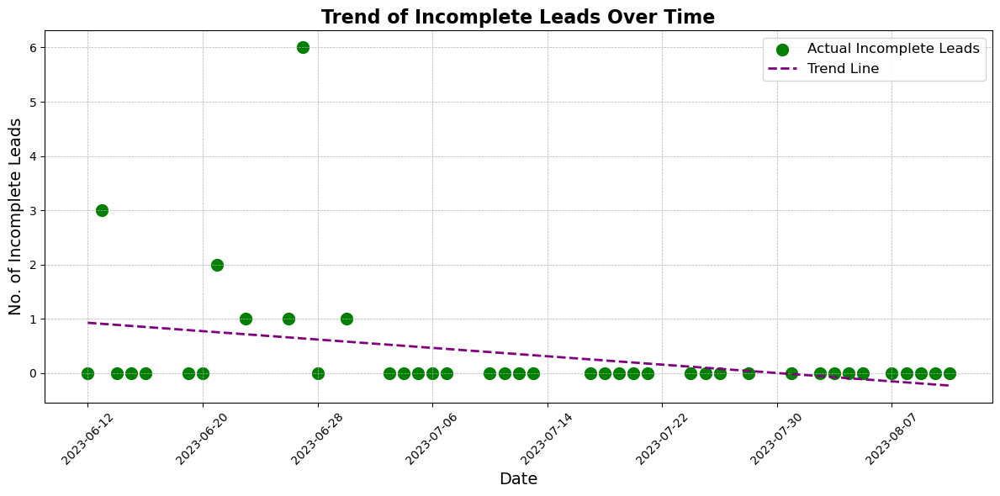
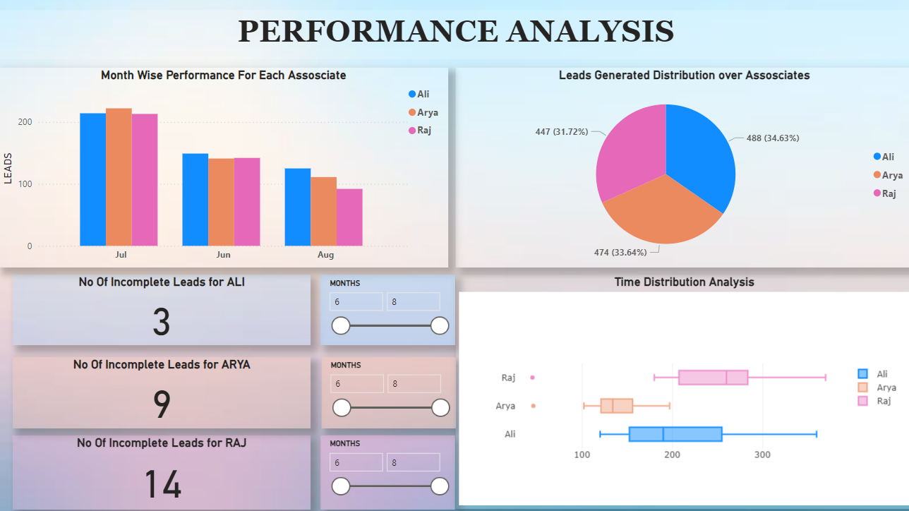
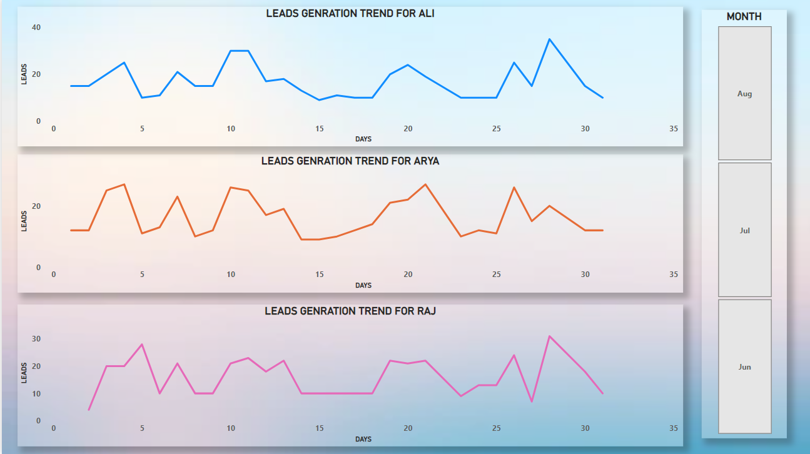
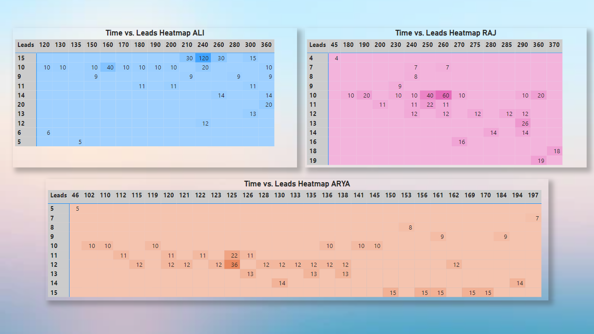

# Performance Analytics and Projections for Business Development
## Antarctica Global

### Author: Akash Tewari

---

## Introduction

This report presents a comprehensive analysis of associate performance data within the Business Development Team. The objective was to uncover actionable insights that could enhance efficiency and productivity. By leveraging various statistical techniques and data visualization methods, this report provides a detailed examination of:

- Lead generation efficiency
- Daily performance variability
- Time management
- Performance consistency
- Predictive analysis for future performance

The findings and recommendations derived from this analysis aim to optimize lead generation efforts and drive better outcomes for the team.

---

## Exploratory Data Analysis (EDA) and Performance Analysis

### 1. EDA and Outliers

- The dataset was initially cleaned, and a box plot was used to detect outliers. It was observed that these outliers could be beneficial in capturing future trends, so no steps were taken to cap these outliers.


### 2. Lead Generation Efficiency

- Arya exhibited the highest lead generation efficiency, making her performance a potential benchmark for other employees.

| Associate | Efficiency |
|-----------|------------|
| Raj       | 0.042230   |
| Arya      | 0.085114   |
| Ali       | 0.052842   |

### 3. Daily Performance Variability

- The standard deviation of daily leads generated indicates that Ali's performance is the most variable, while Arya’s performance is more stable.

| Associate | Efficiency |
|-----------|------------|
| Raj       | 2.653346   |
| Arya      | 2.156951   |
| Ali       | 3.039777   |

### 4. Time Management Analysis

- A negative correlation was found between the average time spent per lead and the total number of leads generated. Arya demonstrated the strongest negative correlation.





### 5. Impact of Daily Team Reviews

- Attending daily team reviews had a positive impact on lead generation, especially for Ali. Arya's consistent attendance reflects a stable work ethic.



### 6. Performance Consistency

- Arya had the lowest coefficient of variation (CV), indicating the most consistent performance among the associates.

### 7. High-Performance Days

- Analysis revealed that more time is spent on lead generation during high-performance days across all associates.



### 8. Impact of Longer Lead Generation Time

- Optimal time thresholds were identified for each associate, suggesting significant increases in leads generated beyond these times.

| Associate | Optimal Time Threshold (mins) |
|-----------|-------------------------------|
| Raj       | 307.86                        |
| Arya      | 126.62                        |
| Ali       | 259.62                        |

### 9. Comparative Day Analysis

- Raj and Ali performed better on weekends, while Arya showed slightly better performance on weekdays.


### 10. Incomplete Leads Reduction Over Time

- Both Raj and Arya showed improvements in reducing incomplete leads over time.



### 11. Predictive Analysis for Lead Generation

- A simple linear regression model was used to predict the number of leads generated based on time spent. The model's accuracy varied significantly among associates, with Raj showing the highest predictive power.

```python
def prepare_data(df):
    # Selecting relevant columns: Time spent on LG and Leads
    X = df['Time spent on LG (mins)'].values.reshape(-1, 1)  # Independent variable
    y = df['Leads'].values  # Dependent variable
    return X, y
def train_and_predict(X, y):
    # Initialize the model
    model = LinearRegression()
    
    # Fit the model on the data
    model.fit(X, y)
    
    # Make predictions
    y_pred = model.predict(X)
    
    return model, y_pred
def evaluate_model(y_true, y_pred):
    # Calculate Mean Absolute Error (MAE)
    mae = mean_absolute_error(y_true, y_pred)
    
    # Calculate R-squared value
    r2 = r2_score(y_true, y_pred)
    
    return mae, r2
def plot_results(df, y_pred, associate_name):
    plt.figure(figsize=(10, 6))
    
    # Plot actual leads
    plt.scatter(df['Time spent on LG (mins)'], df['Leads'], color='blue', label='Actual Leads')
    
    # Plot predicted leads
    plt.plot(df['Time spent on LG (mins)'], y_pred, color='red', linestyle='--', label='Predicted Leads')
    
    # Customize the plot
    plt.title(f'Leads Prediction for {associate_name}', fontsize=16, fontweight='bold')
    plt.xlabel('Time Spent on Lead Generation (mins)', fontsize=14)
    plt.ylabel('Number of Leads', fontsize=14)
    plt.legend()
    plt.grid(False)
    plt.show()
def predictive_analysis(associate_data):
    for associate_name, df in associate_data.items():
        # Prepare the data
        X, y = prepare_data(df)
        
        # Train the model and make predictions
        model, y_pred = train_and_predict(X, y)
        
        # Evaluate the model
        mae, r2 = evaluate_model(y, y_pred)
        
        # Print evaluation metrics
        print(f"Predictive Analysis for {associate_name}:")
        print(f"  Mean Absolute Error (MAE): {mae:.2f}")
        print(f"  R-squared (R2): {r2:.2f}")
        
        # Visualize the results
        plot_results(df, y_pred, associate_name)
        print("\n")

predictive_analysis(cleaned_dfs)


```
| Associate | Mean Absolute Error (MAE) | R-squared (R2) |
|-----------|---------------------------|----------------|
| Raj       | 1.51                      | 0.41           |
| Arya      | 1.49                      | 0.10           |
| Ali       | 2.05                      | 0.27           |

**Model Performance:** The linear regression model's predictive power varies significantly between associates. Raj has the highest R-squared value, indicating that the time he spends on lead generation has a more direct correlation with the number of leads he generates. In contrast, Arya has the lowest R-squared value, suggesting that time spent is not a strong predictor for her lead generation.

**Factors Affecting Performance:**

- For Raj, the model captures a moderate relationship between time spent and leads generated.
- For Arya, the low R-squared suggests that her lead generation might depend on factors other than just time spent, such as the quality of interactions, the time of day, or external market conditions.
- For Ali, while time spent has some predictive power, the higher error rate and moderate R-squared indicate that there are other factors at play that the model does not capture.

---

## Dashboarding

The following visualizations were created to provide a comprehensive overview of the associates' performance:

- **Performance Trend with Attendance**
- **Time vs. Leads Heatmap**
- **Monthly Performance Comparison**
- **Daily Incomplete Leads Trend**
- **Time Distribution Analysis**





---

## Recommendations

### 1. Performance Insights
- Arya’s higher efficiency should be leveraged by sharing her strategies with Ali and Raj.
- High-efficiency associates could be allocated more complex tasks.

### 2. Time Management
- Strategies should be implemented to help associates like Arya reduce the average time spent per lead.

### 3. Impact of Daily Team Reviews
- Encourage consistent attendance in team reviews to improve lead generation.

### 4. Performance Consistency
- Ali’s variability in performance should be addressed to stabilize his lead generation.

### 5. Breakpoint Analysis
- Incentives should be designed based on the optimal time thresholds identified for each associate to maximize lead generation.

---

## Conclusion

This report provides a detailed analysis of associate performance and offers actionable recommendations for the Business Development Team at Antarctica Global. The insights and projections aim to guide the team in improving efficiency and overall performance.

Thank you for the opportunity to work on this assignment!

